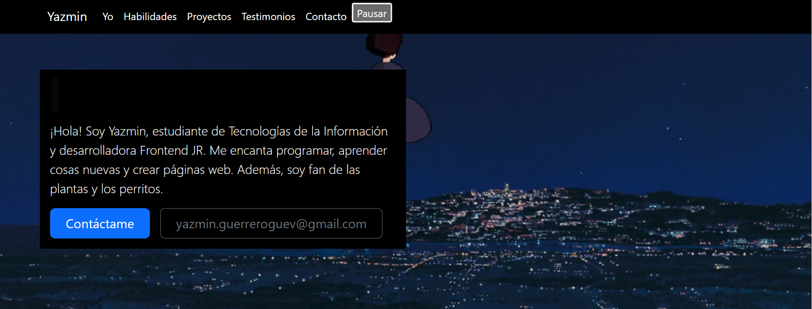
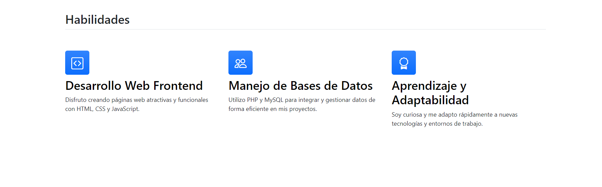
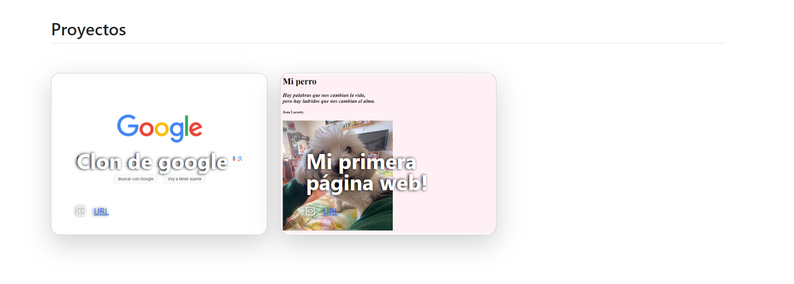
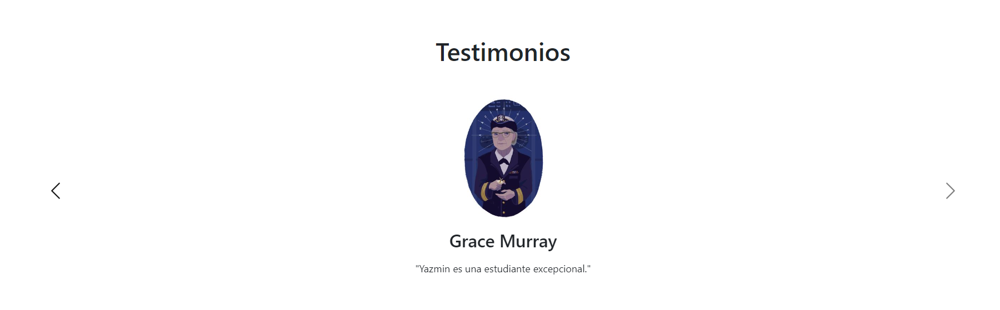
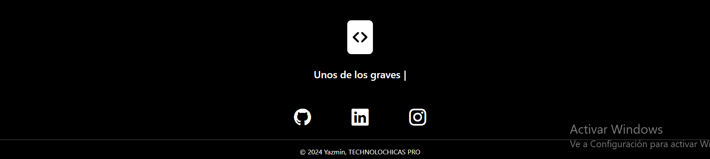

# Portafolio personal de Tecnolochicas PRO <3
Proyecto de un portafolio desarrollado en el Bootcamp de desarrollo FrontEnd de Technolochicas PRO. Desarrollado con tecnologías HTML, CSS, JS con el uso de el framework de UI, Bootstrap utilizando además bibliotecas externas.

El portafolio es responsivo (adaptable a diferentes tamaños de pantalla) e incluye la presentación de la autora del proyecto.

Link del proyecto desplegado: https://portafolioyaz-b7-g1.netlify.app/

<h2>Secciones de mi portafolio: </h2>
	

	
	
	
	

<h4>Creado por Yaz <3 en TecnoLochicas PRO</h4>
